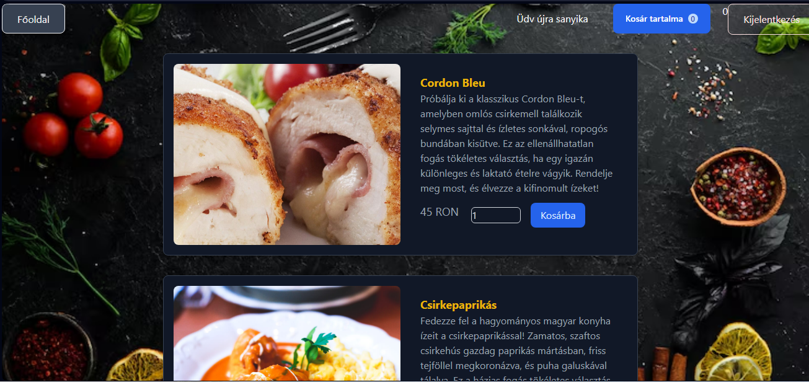
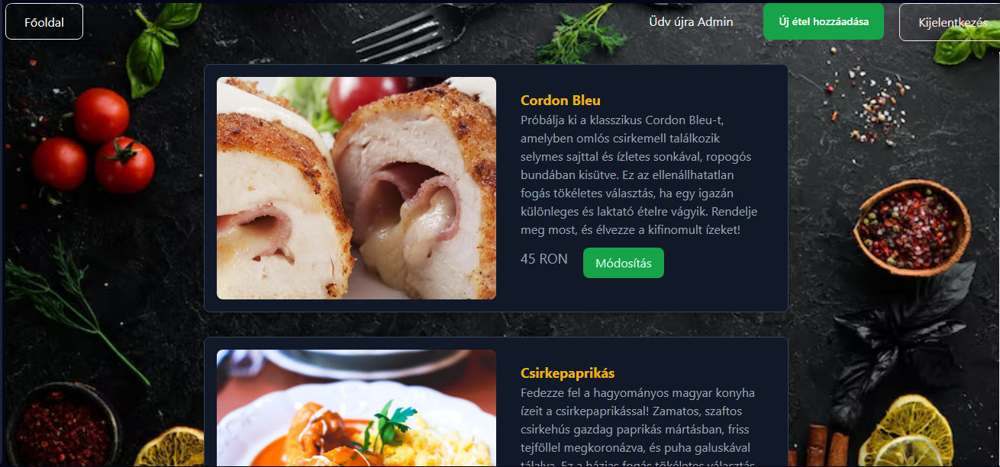
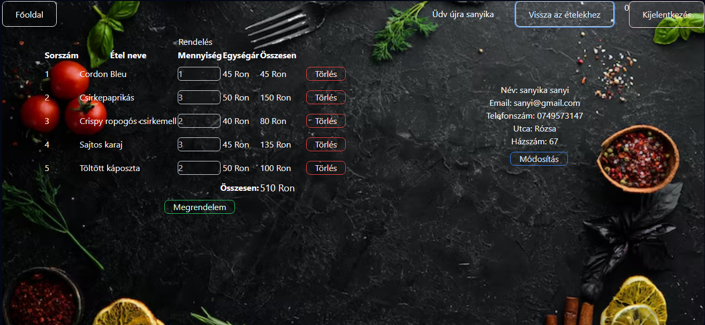

# Online Étterem Rendelői Felület

Ez az alkalmazás egy Laravel és React alapú webes platform, amely lehetővé teszi az ügyfelek számára, hogy online ételrendeléseket végezzenek. A rendszer magában foglal egy adminisztrációs felületet is, amely lehetővé teszi az ételek kezelését és felhasználók nyilvántartását. A projekt Docker-alapú konténerizációval van ellátva.

## Használt technológiák
- **Laravel**: Backend keretrendszer.
- **React**: Frontend felület.
- **Docker**: Konténerizált környezet futtatása.
- **SQLite**: Adatbázis a könnyű helyi tároláshoz.
- **Tailwind CSS**: A kellemes felhasználói élményhez.

## Főbb funkciók
- Online ételrendelési lehetőség.
- Felhasználói bejelentkezés és regisztráció.
- Adminisztrációs felület ételek hozzáadásához, szerkesztéséhez és kezeléséhez.

## Telepítési útmutató (Docker)
A projekt a Docker Hub-ról könnyen letölthető a következő parancsokkal:
   
   docker pull kalapom/etterem-frontend:latest
   docker pull kalapom/etterem-backend:latest

Az alábbi parancsokkal indíthatja el a frontendet és a backendet helyi környezetben a Docker segítségével:

   docker run -d -p 5173:5173 kalapom/etterem-frontend:latest
   docker run -d -p 8000:8000 kalapom/etterem-backend:latest

## Megjegyzések

A weblap adminisztrátori funckióihoz használja a következő felhasználót:

    email: sasa@gmail.com
    jelszó: 123

Tesztelés céljából több fogyasztói felhasználó is elérhető, közülük az egyik:

    email:sanyi@gmail.com
    jelszó: 123,

Természetesen új felhasználó regisztrálására is van lehetőség.

## Gyakori problémák

Jelenleg problémát tapasztaltam a projekt Docker Hub-ról való letöltése és futtatása során, ennek megoldásán dolgozom

## További tervek

A fent említett probléma kiküszöbölése és az oldal reszponzívvá tétele
A rendelési folyamat automatizált értesítésekkel való bővítése (pl. email értesítések).

## Képek

## Köszönöm a figyelmet!
